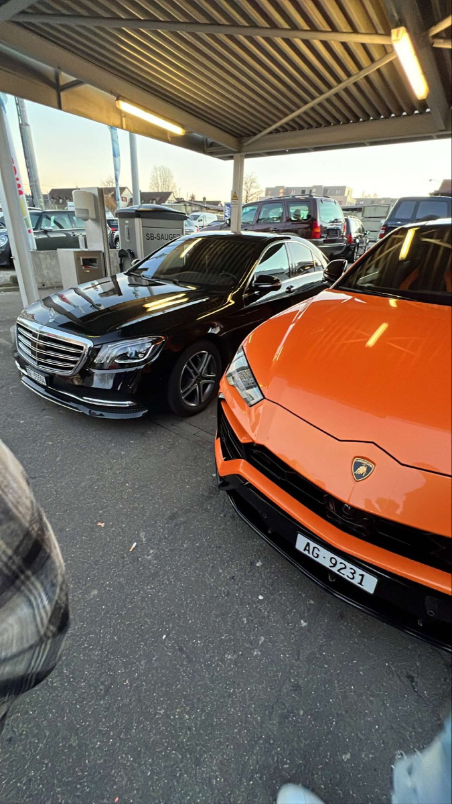
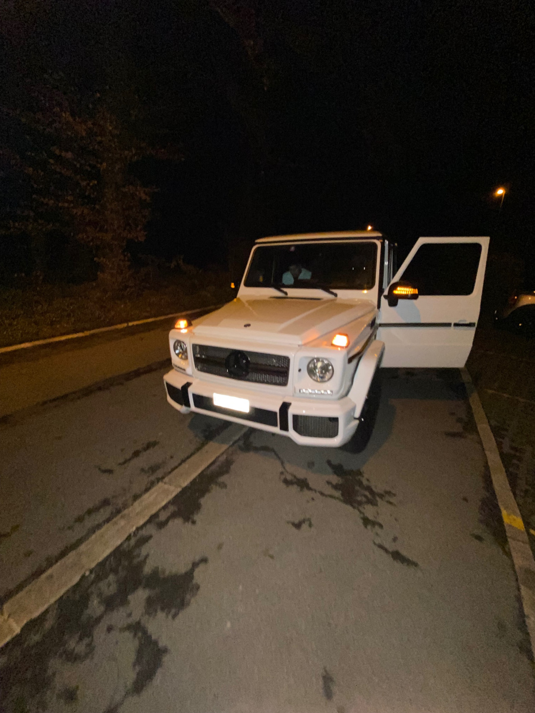
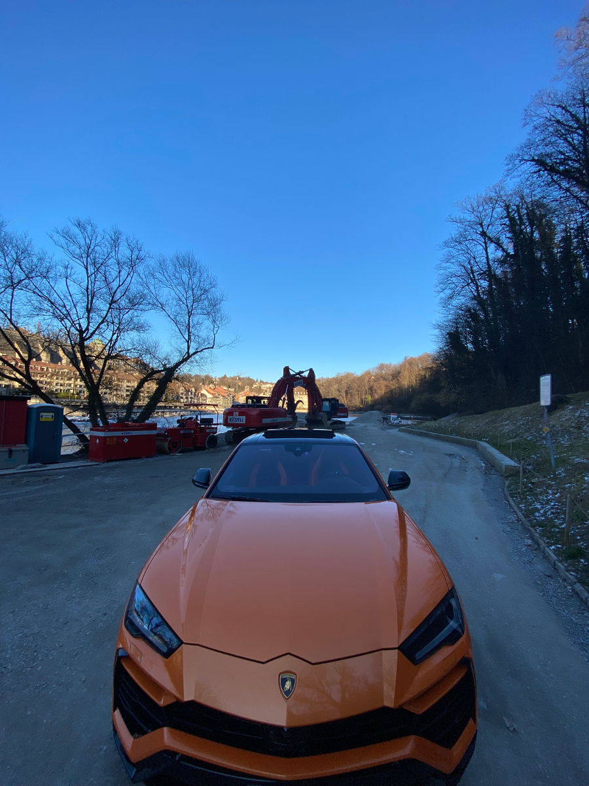

+++
title = "Luxusauto Kurzfilm"
date = "2022-05-12"
draft = false
pinned = false
+++

Als erstes habe ich verschiedene Auto Garagen kontaktiert, um zu fragen wieviel man für die Autos zahlen muss. Ich habe einen Angebot für 2 Autos erhalten.( Lamborghini Urus und Bmw 5 series)  Die Autos wurden in Oftringen abgeholt. Ich und meine Freunde sind dann durch Bern gefahren und haben die Autos dabei gefilmt.  Die Videos wurden mit der Handy Kamera (iPhone 13 pro Max) gefilmt. 

Für die Videos zu editieren habe ich Tik Tok benutzt. Die Kosten für die Autos habe ich selber übernommen. Es war ein teurer Spass, hat sich aber gelohnt. Zudem habe ich mich mit einer anderen Garage verabredet um ein weiters Auto zu vermieten, nämlich der Merzedes Benz G-Klasse. Man musste sehr aufpassen mit den Autos, da sie sehr teuer sind ( Urus ->300 000+ CHF/ G-Klasse -> 250 000 CHF/ BMW 5 series -> 90 000 CHF). Beim FIlmen musste ich aufpassen, da die Autos sehr schnell sind und es hätte schief gehen können. Amir hat mich gefilmt, als ich mit den Lamborghini gefahren bin. Mit der Kamera habe ich nicht gearbeitet, da ich keine "Fish-Eye" Linse hatte.

